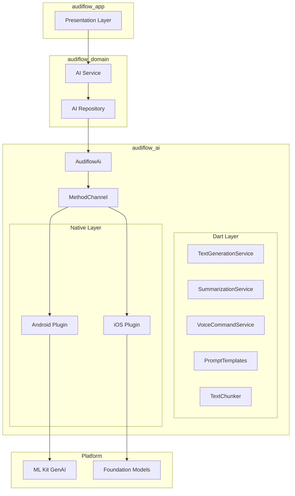
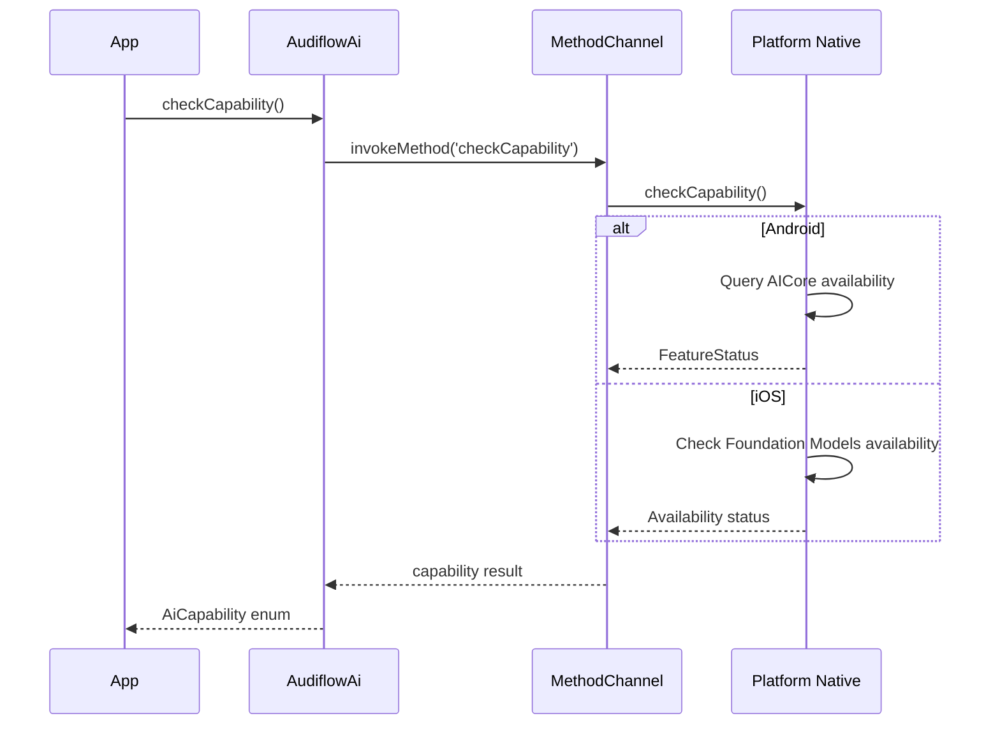
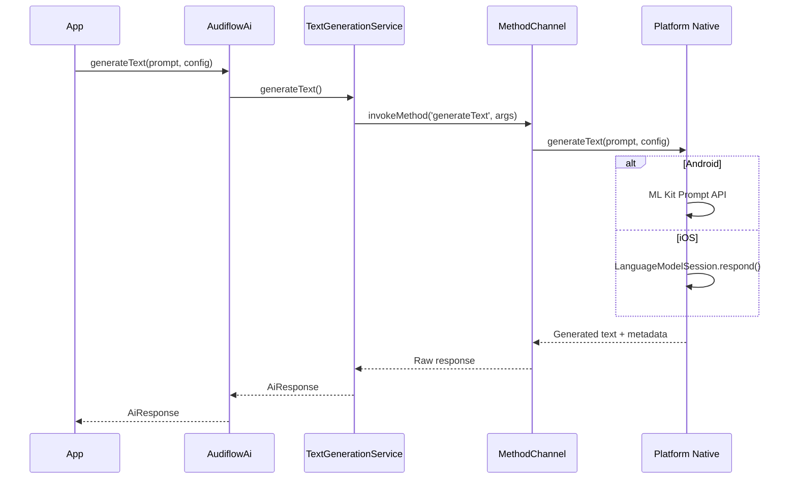
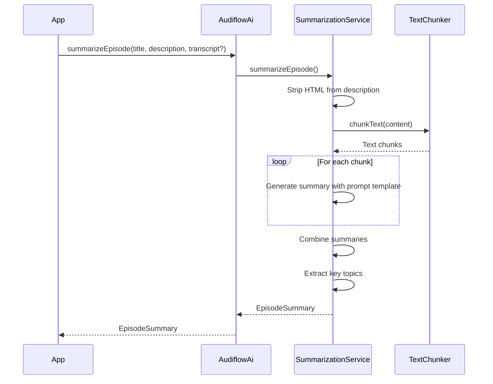
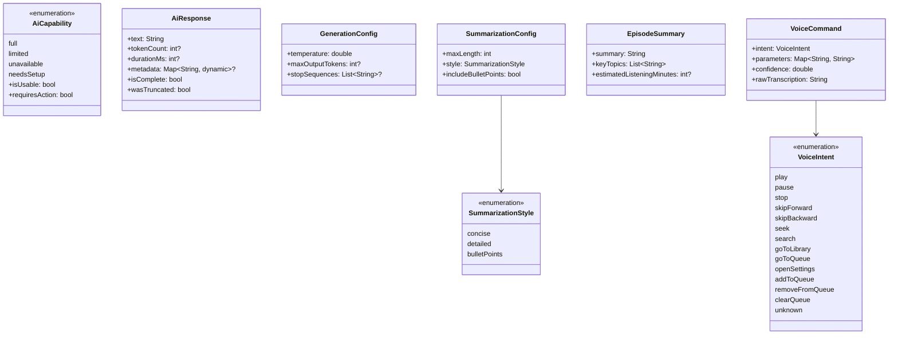

# Design Document: audiflow_ai Package

## Overview

**Purpose**: The `audiflow_ai` package delivers on-device AI capabilities for Audiflow, enabling offline-first summarization, voice command parsing, and text generation on flagship devices (Pixel 8+, iPhone 15 Pro+).

**Users**: Audiflow developers will integrate this package to provide AI-powered features without cloud dependencies or per-use costs.

**Impact**: Migrates from wrapping `flutter_local_ai` to full source code ownership, providing complete control over platform channel implementation and future extensibility.

### Goals

- Migrate Dart, Kotlin, and Swift source code from `flutter_local_ai` into `audiflow_ai`
- Implement platform channels with namespace `com.audiflow/ai`
- Extend with podcast-specific features (episode summarization, voice commands)
- Maintain MIT license attribution
- Achieve 80%+ test coverage

### Non-Goals

- Cloud AI fallback (deferred to future iteration)
- Streaming response support (platform APIs do not yet support)
- Cross-platform model download management (uses system-managed models)
- Real-time voice streaming (uses platform STT + AI processing)

## Architecture

### Architecture Pattern & Boundary Map



**Architecture Integration**:
- Selected pattern: Plugin architecture with platform channels for native API access
- Domain boundaries: `audiflow_ai` is a standalone Flutter plugin; `audiflow_domain` wraps it with caching and business logic
- Existing patterns preserved: Repository pattern, service layer separation
- New components rationale: Direct platform channel ownership enables customization and bug fixes
- Steering compliance: Follows monorepo conventions, Riverpod patterns, and Drift for caching

### Technology Stack

| Layer | Choice / Version | Role in Feature | Notes |
|-------|------------------|-----------------|-------|
| Dart | 3.10+ | Main API, prompt engineering, text chunking | No external AI dependencies |
| Android Native | Kotlin + ML Kit GenAI 1.0.0-alpha1 | Gemini Nano access via AICore | minSdk 26 |
| iOS Native | Swift + Foundation Models | Apple on-device LLM | iOS 26.0+ deployment target |
| Data (future) | Drift | Response caching in audiflow_domain | Out of scope for this package |

## System Flows

### Capability Check Flow



### Text Generation Flow



### Episode Summarization Flow



## Requirements Traceability

| Requirement | Summary | Components | Interfaces | Flows |
|-------------|---------|------------|------------|-------|
| 1.1-1.6 | Device capability detection | AudiflowAi, AudiflowAiPlugin | checkCapability(), promptAiCoreInstall() | Capability Check |
| 2.1-2.6 | AI engine initialization | AudiflowAi, TextGenerationService, AudiflowAiPlugin | initialize(), isInitialized | - |
| 3.1-3.6 | Text generation | TextGenerationService, AudiflowAiPlugin | generateText(), AiResponse | Text Generation |
| 4.1-4.7 | Text summarization | SummarizationService, TextChunker | summarize(), SummarizationConfig | - |
| 5.1-5.6 | Episode summarization | SummarizationService, PromptTemplates | summarizeEpisode(), EpisodeSummary | Episode Summarization |
| 6.1-6.7 | Voice command parsing | VoiceCommandService | parseVoiceCommand(), VoiceCommand | - |
| 7.1-7.10 | Android native layer | AudiflowAiPlugin (Kotlin) | Platform channel methods | All native flows |
| 8.1-8.10 | iOS native layer | AudiflowAiPlugin (Swift) | Platform channel methods | All native flows |
| 9.1-9.7 | Model data structures | All model classes | See Data Models | - |
| 10.1-10.9 | Error handling | AudiflowAiException hierarchy | Exception types | - |
| 11.1-11.5 | Text processing utilities | TextChunker, HtmlUtils | TextChunker, stripHtml() | - |
| 12.1-12.6 | Prompt templates | PromptTemplates | Template constants and methods | - |
| 13.1-13.8 | Source code migration | All components | - | - |
| 14.1-14.7 | Package structure | Package layout | audiflow_ai.dart exports | - |
| 15.1-15.6 | Resource management | AudiflowAi, native plugins | dispose(), CancellationToken | - |

## Components and Interfaces

| Component | Domain/Layer | Intent | Req Coverage | Key Dependencies | Contracts |
|-----------|--------------|--------|--------------|------------------|-----------|
| AudiflowAi | Dart/API | Main entry point for AI features | 1, 2, 3, 4, 5, 6, 15 | TextGenerationService (P0) | Service |
| AudiflowAiPlugin (Android) | Kotlin/Native | ML Kit GenAI integration | 1, 2, 3, 7 | ML Kit GenAI (P0) | API |
| AudiflowAiPlugin (iOS) | Swift/Native | Foundation Models integration | 1, 2, 3, 8 | Foundation Models (P0) | API |
| TextGenerationService | Dart/Service | Text generation orchestration | 3 | MethodChannel (P0) | Service |
| SummarizationService | Dart/Service | Summarization with chunking | 4, 5 | TextGenerationService (P0), TextChunker (P1) | Service |
| VoiceCommandService | Dart/Service | Voice command parsing | 6 | TextGenerationService (P0) | Service |
| TextChunker | Dart/Utility | Split long text for processing | 11 | None | - |
| PromptTemplates | Dart/Utility | Podcast-optimized prompts | 12 | None | - |
| Exception hierarchy | Dart/Model | Error handling | 10 | None | - |

### Dart Layer

#### AudiflowAi

| Field | Detail |
|-------|--------|
| Intent | Main entry point providing unified API for on-device AI features |
| Requirements | 1.1-1.6, 2.1-2.6, 3.1-3.6, 4.1-4.7, 5.1-5.6, 6.1-6.7, 15.1-15.6 |

**Responsibilities & Constraints**
- Facade for all AI operations
- Manages initialization state
- Coordinates service instances
- Handles platform-specific behavior

**Dependencies**
- Outbound: TextGenerationService, SummarizationService, VoiceCommandService (P0)
- External: MethodChannel `com.audiflow/ai` (P0)

**Contracts**: Service [x]

##### Service Interface

```dart
abstract final class AudiflowAi {
  /// Current initialization state
  static bool get isInitialized;

  /// Check device AI capability
  static Future<AiCapability> checkCapability();

  /// Initialize AI engine with optional custom instructions
  /// Throws: AiNotAvailableException, AiCoreRequiredException
  static Future<void> initialize({String? systemInstructions});

  /// Reinitialize with new configuration
  static Future<void> reinitialize({String? systemInstructions});

  /// Generate text from prompt
  /// Throws: AiNotInitializedException, PromptTooLongException, AiGenerationException
  static Future<AiResponse> generateText({
    required String prompt,
    GenerationConfig? config,
  });

  /// Summarize arbitrary text
  /// Throws: AiNotInitializedException, AiSummarizationException
  static Future<String> summarize({
    required String text,
    SummarizationConfig? config,
  });

  /// Summarize podcast episode with context
  /// Throws: AiNotInitializedException, InsufficientContentException
  static Future<EpisodeSummary> summarizeEpisode({
    required String title,
    required String description,
    String? transcript,
    SummarizationConfig? config,
  });

  /// Parse voice command transcription
  /// Throws: AiNotInitializedException
  static Future<VoiceCommand> parseVoiceCommand({
    required String transcription,
  });

  /// Open AICore install page (Android only)
  static Future<bool> promptAiCoreInstall();

  /// Release native resources
  static Future<void> dispose();
}
```

- Preconditions: `checkCapability()` should return usable capability before `initialize()`
- Postconditions: After `initialize()`, `isInitialized` returns `true`
- Invariants: Methods requiring initialization throw `AiNotInitializedException` if not initialized

#### TextGenerationService

| Field | Detail |
|-------|--------|
| Intent | Orchestrates text generation via platform channel |
| Requirements | 3.1-3.6 |

**Responsibilities & Constraints**
- Invokes platform-specific text generation
- Applies generation configuration
- Maps platform responses to `AiResponse`

**Dependencies**
- External: MethodChannel `com.audiflow/ai` (P0)

**Contracts**: Service [x]

##### Service Interface

```dart
class TextGenerationService {
  TextGenerationService();

  bool get isInitialized;

  Future<bool> isAvailable();

  Future<void> initialize({String? systemInstructions});

  Future<AiResponse> generateText({
    required String prompt,
    GenerationConfig? config,
  });

  Future<String> generateTextSimple({
    required String prompt,
    int maxTokens = 500,
  });

  Future<void> dispose();
}
```

#### SummarizationService

| Field | Detail |
|-------|--------|
| Intent | Provides summarization with automatic text chunking |
| Requirements | 4.1-4.7, 5.1-5.6 |

**Responsibilities & Constraints**
- Chunks long text using `TextChunker`
- Applies summarization-specific prompts
- Combines chunk summaries for long content
- Strips HTML from input

**Dependencies**
- Inbound: AudiflowAi (P0)
- Outbound: TextGenerationService (P0), TextChunker (P1), PromptTemplates (P1)

**Contracts**: Service [x]

##### Service Interface

```dart
class SummarizationService {
  SummarizationService({required TextGenerationService textGenerationService});

  Future<String> summarize({
    required String text,
    required SummarizationConfig config,
  });

  Future<EpisodeSummary> summarizeEpisode({
    required String title,
    required String description,
    String? transcript,
    required SummarizationConfig config,
  });
}
```

#### VoiceCommandService

| Field | Detail |
|-------|--------|
| Intent | Parses voice transcriptions into structured commands |
| Requirements | 6.1-6.7 |

**Responsibilities & Constraints**
- Uses AI to parse natural language into commands
- Extracts command type and parameters
- Returns confidence score

**Dependencies**
- Outbound: TextGenerationService (P0), PromptTemplates (P1)

**Contracts**: Service [x]

##### Service Interface

```dart
class VoiceCommandService {
  VoiceCommandService({required TextGenerationService textGenerationService});

  Future<VoiceCommand> parseCommand(String transcription);
}
```

### Native Layer

#### AudiflowAiPlugin (Android - Kotlin)

| Field | Detail |
|-------|--------|
| Intent | Android platform channel handler using ML Kit GenAI |
| Requirements | 7.1-7.10 |

**Responsibilities & Constraints**
- Initializes ML Kit GenAI API
- Handles AICore availability and lifecycle
- Processes method channel calls
- Maps errors to platform exceptions

**Dependencies**
- External: ML Kit GenAI 1.0.0-alpha1 (P0), Google Play Services Tasks (P1)

**Contracts**: API [x]

##### API Contract

| Method | Channel | Request | Response | Errors |
|--------|---------|---------|----------|--------|
| checkCapability | com.audiflow/ai | - | {status: String} | - |
| initialize | com.audiflow/ai | {instructions: String?} | {success: bool} | AiNotAvailable, AiCoreRequired |
| generateText | com.audiflow/ai | {prompt: String, config: Map?} | {text: String, tokenCount: int?} | GenerationFailed, PromptTooLong |
| dispose | com.audiflow/ai | - | {success: bool} | - |

**Implementation Notes**
- Integration: Register plugin in `FlutterActivity.configureFlutterEngine()`
- Validation: Check AICore availability before any operations
- Risks: AICore may not be installed (error code -101); prompt user to install

#### AudiflowAiPlugin (iOS - Swift)

| Field | Detail |
|-------|--------|
| Intent | iOS platform channel handler using Foundation Models |
| Requirements | 8.1-8.10 |

**Responsibilities & Constraints**
- Initializes Foundation Models framework
- Manages LanguageModelSession lifecycle
- Processes method channel calls
- Handles memory for large text processing

**Dependencies**
- External: Foundation Models framework (P0)

**Contracts**: API [x]

##### API Contract

| Method | Channel | Request | Response | Errors |
|--------|---------|---------|----------|--------|
| checkCapability | com.audiflow/ai | - | {status: String} | - |
| initialize | com.audiflow/ai | {instructions: String?} | {success: bool} | AiNotAvailable |
| generateText | com.audiflow/ai | {prompt: String, config: Map?} | {text: String} | GenerationFailed |
| dispose | com.audiflow/ai | - | {success: bool} | - |

**Implementation Notes**
- Integration: Register via `SwiftAudiflowAiPlugin.register(with:)`
- Validation: Check `SystemLanguageModel.default.availability` before operations
- Risks: Foundation Models only on iOS 26+; requires Apple Intelligence capability

### Utilities

#### TextChunker

| Field | Detail |
|-------|--------|
| Intent | Splits long text into processable chunks |
| Requirements | 11.1-11.3 |

**Implementation Notes**
- Default chunk size: 2000 characters
- Default overlap: 100 characters
- Respects sentence boundaries when possible
- Respects paragraph boundaries when possible

#### PromptTemplates

| Field | Detail |
|-------|--------|
| Intent | Provides podcast-optimized prompt templates |
| Requirements | 12.1-12.6 |

**Implementation Notes**
- Summarization template with style options (concise, detailed, bullet points)
- Voice command parsing template with supported intents
- Topic extraction template
- Variable substitution with `{placeholder}` syntax
- Configurable via static setter for customization

## Data Models

### Domain Model



### Model Definitions

All models are immutable classes. Use `@freezed` annotation for code generation where beneficial (complex models with copyWith requirements).

**AiCapability** (Requirement 9.1)
- Enum with extension for `isUsable`, `requiresAction`, `description`

**AiResponse** (Requirement 9.2)
- text: String (required)
- tokenCount: int? (optional, platform-dependent)
- durationMs: int? (optional)
- metadata: Map<String, dynamic>? (optional, for extensibility)

**GenerationConfig** (Requirement 9.3)
- temperature: double (default 0.7, range 0.0-1.0)
- maxOutputTokens: int? (default null, uses platform default)
- stopSequences: List<String>? (optional)

**SummarizationConfig** (Requirement 9.4)
- maxLength: int (default 200 words)
- style: SummarizationStyle (default concise)
- includeBulletPoints: bool (default false)

**EpisodeSummary** (Requirement 9.5)
- summary: String (required)
- keyTopics: List<String> (required, may be empty)
- estimatedListeningMinutes: int? (optional)

**VoiceCommand** (Requirement 9.6)
- intent: VoiceIntent (required)
- parameters: Map<String, String> (required, may be empty)
- confidence: double (required, 0.0-1.0)
- rawTranscription: String (required)

## Error Handling

### Error Strategy

Hierarchical exception classes with specific error types for different failure modes. All exceptions extend `AudiflowAiException` which extends `AppException` from `audiflow_core`.

### Error Categories and Responses

```dart
/// Base exception for all AI-related errors
class AudiflowAiException extends AppException {
  AudiflowAiException(super.message, [super.code, this.cause]);
  final Object? cause;
}

/// Device does not support on-device AI
class AiNotAvailableException extends AudiflowAiException {
  AiNotAvailableException([String? details])
    : super(
        details ?? 'On-device AI is not available on this device',
        'AI_NOT_AVAILABLE',
      );
}

/// AI methods called before initialization
class AiNotInitializedException extends AudiflowAiException {
  AiNotInitializedException()
    : super(
        'AI engine not initialized. Call AudiflowAi.initialize() first.',
        'AI_NOT_INITIALIZED',
      );
}

/// Android-specific: AICore not installed
class AiCoreRequiredException extends AudiflowAiException {
  AiCoreRequiredException()
    : super(
        'Google AICore is required. Call AudiflowAi.promptAiCoreInstall().',
        'AICORE_REQUIRED',
      );
}

/// Text generation failed
class AiGenerationException extends AudiflowAiException {
  AiGenerationException(String message, [Object? cause])
    : super(message, 'AI_GENERATION_FAILED', cause);
}

/// Summarization failed
class AiSummarizationException extends AudiflowAiException {
  AiSummarizationException(String message, [Object? cause])
    : super(message, 'AI_SUMMARIZATION_FAILED', cause);
}

/// Prompt exceeds model context limit
class PromptTooLongException extends AudiflowAiException {
  PromptTooLongException(this.maxTokens)
    : super(
        'Prompt exceeds maximum length of $maxTokens tokens',
        'PROMPT_TOO_LONG',
      );
  final int maxTokens;
}

/// Input content too short or empty
class InsufficientContentException extends AudiflowAiException {
  InsufficientContentException([String? details])
    : super(
        details ?? 'Insufficient content for processing',
        'INSUFFICIENT_CONTENT',
      );
}
```

### Monitoring

- Log initialization success/failure with device info
- Log generation requests with prompt length (not content)
- Log errors with exception type and cause chain
- Use `namedLoggerProvider('AudiflowAi')` from audiflow_domain

## Testing Strategy

### Unit Tests

- `AiCapability` enum extension methods
- `AiResponse` equality and hash code
- `GenerationConfig` defaults and validation
- `SummarizationConfig` style application
- `VoiceCommand` parameter extraction
- `TextChunker` boundary detection (sentence, paragraph)
- `PromptTemplates` variable substitution
- Exception hierarchy toString and code values

### Integration Tests

- `AudiflowAi.checkCapability()` returns valid enum on all platforms
- `AudiflowAi.initialize()` succeeds on supported devices
- `AudiflowAi.generateText()` returns valid response with test prompt
- `SummarizationService` handles long text chunking correctly
- Platform channel communication round-trip

### Platform-Specific Tests

- Android: AICore availability detection, error code -101 handling
- iOS: Foundation Models availability on iOS 26+

### Coverage Target

80% code coverage for Dart layer; native layer tested via integration tests.

## Optional Sections

### Security Considerations

- No data leaves device (on-device AI)
- No PII logging (prompt content not logged)
- Prompt templates do not include user data
- Native memory cleared after processing

### Performance & Scalability

| Operation | Target | Notes |
|-----------|--------|-------|
| Capability check | < 100ms | Cached after first call |
| Initialization | < 500ms | One-time cost |
| Text generation | < 2s for 500 tokens | Device-dependent |
| Episode summarization | < 5s | Includes chunking |

**Optimization strategies**:
- Warmup call after initialization to preload model
- Chunking prevents memory pressure on long text
- Background isolate for text preprocessing (> 100ms operations)

### Migration Strategy

#### Phase 1: Package Structure Setup
1. Remove `flutter_local_ai` dependency from pubspec.yaml
2. Create `android/` directory with Kotlin plugin structure
3. Create `ios/` directory with Swift plugin structure
4. Update platform channel name to `com.audiflow/ai`

#### Phase 2: Native Code Migration
1. Copy and refactor Kotlin source from flutter_local_ai
2. Copy and refactor Swift source from flutter_local_ai
3. Update package namespaces and class names
4. Add MIT license attribution headers

#### Phase 3: Dart Layer Update
1. Replace flutter_local_ai imports with direct MethodChannel calls
2. Update TextGenerationService to use new channel
3. Verify all existing tests pass

#### Rollback Triggers
- Platform channel communication failure
- Native crash on initialization
- Test coverage drops below 70%

## Supporting References

### Platform Channel Protocol

```dart
// Method channel name
const String kChannelName = 'com.audiflow/ai';

// Method names
const String kCheckCapability = 'checkCapability';
const String kInitialize = 'initialize';
const String kGenerateText = 'generateText';
const String kDispose = 'dispose';

// Response keys
const String kStatus = 'status';
const String kText = 'text';
const String kTokenCount = 'tokenCount';
const String kSuccess = 'success';
const String kErrorCode = 'errorCode';
const String kErrorMessage = 'errorMessage';

// Capability status values
const String kStatusFull = 'full';
const String kStatusLimited = 'limited';
const String kStatusUnavailable = 'unavailable';
const String kStatusNeedsSetup = 'needsSetup';
```

### License Attribution

All migrated source files must include:

```
// Portions of this code are derived from flutter_local_ai
// (https://github.com/kekko7072/flutter_local_ai)
// Copyright (c) 2025 kekko7072
// Licensed under the MIT License
```
