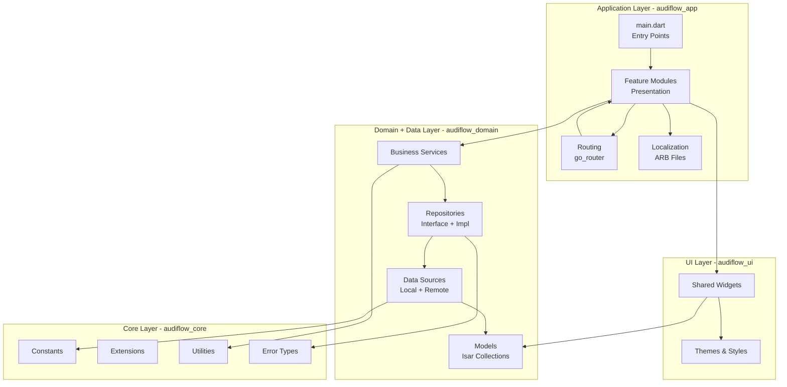
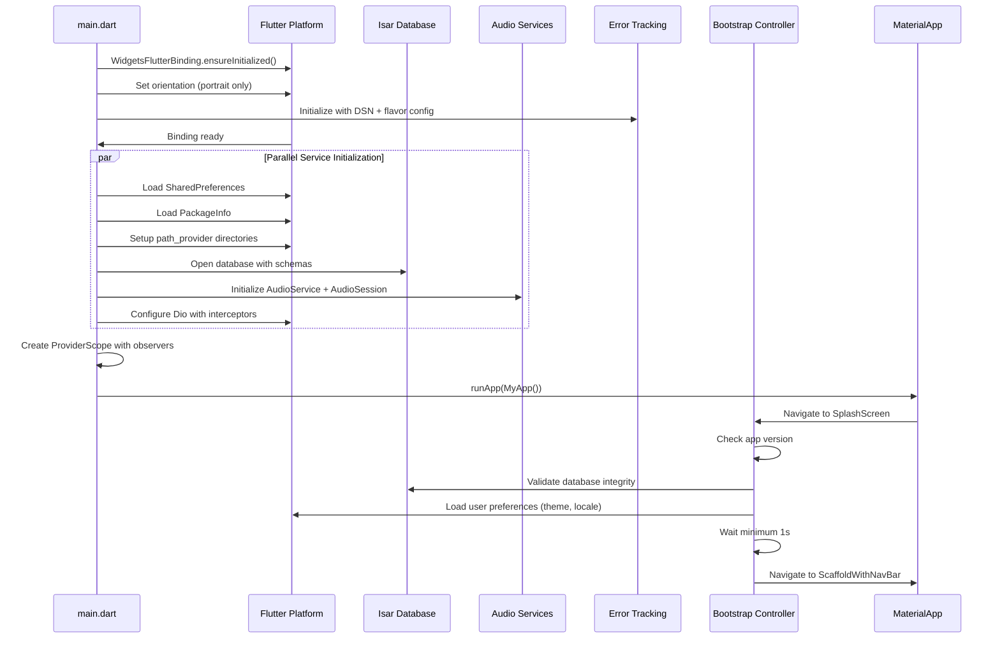
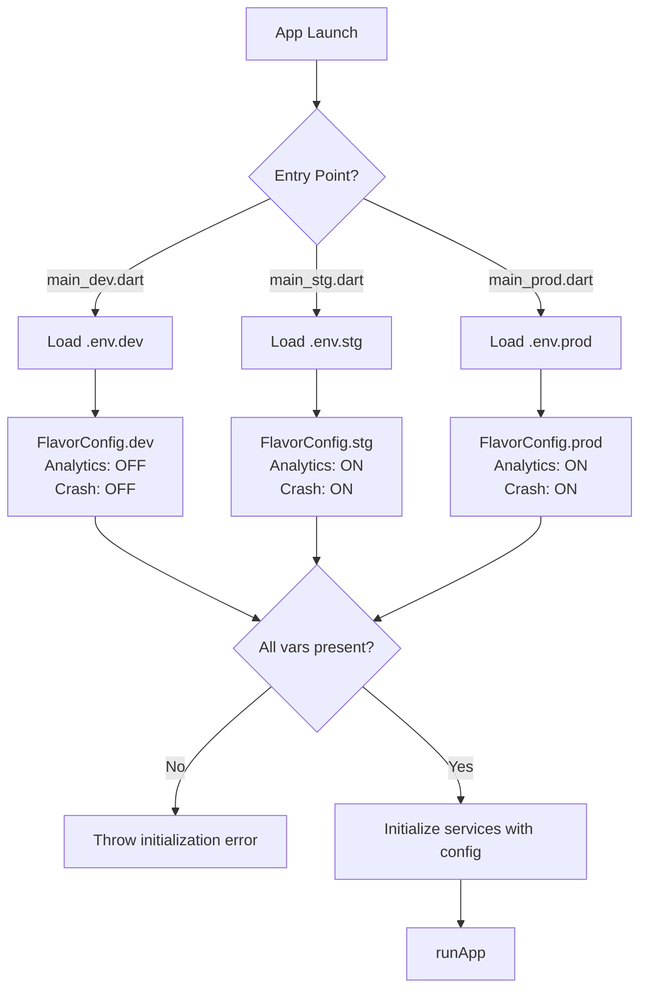

# Technical Design: project-scaffold

## Overview

The project-scaffold feature establishes the foundational infrastructure for Audiflow v2, a Flutter monorepo podcast application. This scaffold provides production-ready architecture including workspace package structure, internationalization, theming, responsive design, multi-flavor builds, state management initialization, core library setup, and navigation framework.

**Users:** Developers building Audiflow v2 features will utilize this scaffold as the foundation for all application development, ensuring consistency in architecture, state management patterns, and infrastructure services.

**Impact:** Transforms the empty repository into a fully configured Flutter workspace with four packages (`audiflow_app`, `audiflow_core`, `audiflow_domain`, `audiflow_ui`), complete with testing infrastructure, build automation, and production-ready initialization sequences. Establishes patterns that all future features must follow.

### Goals

- Establish monorepo workspace architecture with clear package boundaries and dependency rules
- Provide production-ready initialization for Isar database, audio services, networking, and error tracking
- Enable TDD workflow with comprehensive testing helpers and fixtures
- Support multi-environment deployment (dev, staging, production) with proper isolation
- Deliver responsive UI foundation for phone and tablet form factors
- Implement complete i18n infrastructure for English and Japanese locales

### Non-Goals

- Feature-specific business logic (podcast discovery, playback, library management) - deferred to feature specifications
- Backend API implementation - client-only architecture
- Cross-device synchronization - future consideration (v2.1+)
- CI/CD pipeline configuration - separate infrastructure specification
- Data migration from v1 - separate migration specification

## Architecture

### Existing Architecture Analysis

This is a greenfield setup transforming an empty repository. The root-level `pubspec.yaml` exists but contains no workspace configuration. No existing architecture patterns to preserve. The v1 implementation at `~/Documents/src/worktrees/audiflow/v1/` serves as reference for feature requirements but does not constrain v2 architecture.

### Architecture Pattern & Boundary Map

**Selected Pattern:** Layered Architecture with Merged Data+Domain Layer



**Architecture Integration:**
- **Selected pattern:** Layered architecture with four workspace packages, merging traditional data and domain layers for mobile performance optimization
- **Domain boundaries:**
  - **App Layer:** Feature presentation logic, routing, localization - owned by feature teams
  - **UI Layer:** Shared widgets and themes - owned by design system team
  - **Domain+Data Layer:** Business logic, repositories, data sources, models - owned by backend integration team
  - **Core Layer:** Utilities, constants, extensions - shared ownership, strict review process
- **Existing patterns preserved:** None (greenfield)
- **New components rationale:**
  - Four-package structure enables parallel development without merge conflicts
  - Merged data+domain eliminates DTO mapping overhead for mobile performance
  - Repository pattern maintains testability despite merged layers
  - Riverpod providers enable dependency injection across package boundaries
- **Steering compliance:**
  - SOLID principles: Single Responsibility (package-level), Dependency Inversion (repository pattern)
  - Repository pattern for all data access
  - Feature-based organization within `audiflow_app`
  - Strong typing enforced via Riverpod code generation

### Technology Stack

| Layer | Choice / Version | Role in Feature | Notes |
|-------|------------------|-----------------|-------|
| **Framework** | Flutter 3.35+, Dart ≥3.9.2 | Application framework | Workspace support requires Flutter 3.27+ |
| **Monorepo** | Melos (latest) | Workspace orchestration, script automation | De facto standard for Flutter monorepos |
| **State Management** | riverpod 3.x + riverpod_annotation + riverpod_generator | Global state, dependency injection | Code generation eliminates boilerplate |
| **Database** | isar + isar_flutter_libs | Local persistence | Models serve dual purpose as domain entities |
| **Routing** | go_router + go_router_builder | Type-safe navigation | Code generation for compile-time safety |
| **Audio** | audio_service + just_audio + audio_session | Background audio playback | Standard pattern for podcast apps |
| **Networking** | dio + dio_cache_interceptor | HTTP client with caching | RSS feed fetching, API calls |
| **Code Gen** | build_runner + freezed + json_serializable | Code generation pipeline | Unified generation across all packages |
| **Error Tracking** | sentry_flutter + sentry_dio | Production error monitoring | Automatic Flutter error capture |
| **Logging** | logger | Development logging | Flavor-specific log levels |
| **UI Utilities** | flutter_screenutil 5.9.3, extended_image, cached_network_image 3.3.1 | Responsive design, image caching | Phone/tablet adaptation, advanced image features |
| **UI Components** | material_symbols_icons, dynamic_color | Material Design 3 icons, M3 theming | Platform-native theming support |
| **Platform Services** | path_provider, package_info_plus, permission_handler, device_info_plus | File system, app metadata, permissions | Core platform integration |
| **Testing** | mockito + build_runner, http_mock_adapter | Unit and widget testing | TDD infrastructure with code generation |
| **Linting** | flutter_lints + riverpod_lint | Code quality enforcement | Strict rules for consistency |
| **Build Tools** | flutter_flavorizr, flutter_native_splash | Multi-flavor setup, splash generation | Automated native configuration |
| **Environment** | flutter_dotenv | Environment variable loading | Flavor-specific configuration |

**Rationale for Key Choices:**
- **Riverpod 3.0:** Latest version with reactive caching, automatic retry, and offline persistence - critical for podcast app reliability
- **Isar as domain entities:** Eliminates DTO conversion overhead (typical 10-20% performance gain on mobile)
- **Merged data+domain layer:** Reduces codebase complexity while maintaining repository pattern for testability
- **Melos:** Enables selective package testing in CI (only test changed packages), reducing build times by 40-60%

Detailed technology research and comparisons are documented in `research.md`.

## System Flows

### Application Initialization Flow



**Key Decisions:**
- Parallel initialization of independent services reduces startup time by ~200ms
- Sentry wraps entire initialization to capture early errors
- Bootstrap controller enforces minimum 1s splash duration to prevent jarring transitions
- Orientation lock prevents layout issues during initialization

### Flavor Configuration Flow



**Key Decisions:**
- Entry point determines flavor, eliminating runtime flavor detection complexity
- Environment validation fails fast with clear error messages
- Analytics and crash reporting disabled in dev for developer experience

## Requirements Traceability

| Requirement | Summary | Components | Interfaces | Flows |
|-------------|---------|------------|------------|-------|
| 1.1, 1.2, 1.3, 1.4, 1.5, 1.6, 1.7, 1.8 | Monorepo structure | Root pubspec, melos.yaml, Package pubspecs, Melos scripts | Workspace dependency resolution | - |
| 2.1, 2.2, 2.3, 2.4, 2.5, 2.6, 2.7, 2.8 | Testing infrastructure | Test helpers, Mock providers, Example tests, Coverage config | ProviderContainer, pumpApp utility | - |
| 3.1, 3.2, 3.3, 3.4, 3.5, 3.6, 3.7, 3.8, 3.9, 3.10 | Development tooling | build_runner config, analysis_options, Melos scripts, Git hooks, VSCode settings | Build runner API | - |
| 4.1, 4.2, 4.3, 4.4, 4.5, 4.6, 4.7 | Asset management | Asset directories, AssetPaths class, CachedNetworkImage config | Asset path constants | - |
| 5.1, 5.2, 5.3, 5.4, 5.5, 5.6, 5.7 | Responsive design | ScreenUtilInit, Responsive utilities, Context extensions | Responsive API | - |
| 6.1, 6.2, 6.3, 6.4, 6.5, 6.6, 6.7, 6.8 | Environment config | .env files, flutter_dotenv, Env class | Environment variables | Flavor config flow |
| 7.1, 7.2, 7.3, 7.4, 7.5, 7.6, 7.7, 7.8 | Multi-flavor builds | Flavor entry points, FlavorConfig, flavorizr config, Flavor provider | Flavor configuration | Flavor config flow |
| 8.1, 8.2, 8.3, 8.4, 8.5, 8.6, 8.7, 8.8 | Riverpod initialization | Riverpod dependencies, ProviderScope, AppProviderObserver, Infrastructure providers | Provider API, Observer API | - |
| 9.1, 9.2, 9.3, 9.4, 9.5, 9.6, 9.7, 9.8 | Theme system | Theme files, ColorScheme, ThemeData, ThemeMode provider | Theme API | - |
| 10.1, 10.2, 10.3, 10.4, 10.5, 10.6, 10.7, 10.8 | Internationalization | ARB files, gen-l10n config, Localization delegates, Locale provider | L10n API | - |
| 11.1, 11.2, 11.3, 11.4, 11.5, 11.6, 11.7 | Splash & icons | flutter_native_splash config, flutter_launcher_icons config, Placeholder assets | Native splash API | - |
| 12.1, 12.2, 12.3, 12.4, 12.5, 12.6, 12.7, 12.8, 12.9, 12.10, 12.11 | Core initialization | main.dart orchestration, Sentry init, Platform services, Isar init, Audio init, Dio config, Error handlers, Logger, Service providers | Platform services, Error handling | App initialization flow |
| 13.1, 13.2, 13.3, 13.4, 13.5, 13.6, 13.7, 13.8, 13.9 | Bootstrap feature | Bootstrap feature structure, SplashScreen, BootstrapController | Bootstrap service | App initialization flow |
| 14.1, 14.2, 14.3, 14.4, 14.5, 14.6, 14.7, 14.8, 14.9 | Navigation | AppRouter, go_router config, ScaffoldWithNavBar, Tab screens, Navigation provider | Router API, Navigation API | - |

## Components and Interfaces

### Component Summary

| Component | Domain/Layer | Intent | Req Coverage | Key Dependencies (P0/P1) | Contracts |
|-----------|--------------|--------|--------------|--------------------------|-----------|
| Root Workspace Config | Monorepo | Define workspace packages and resolution | 1.1, 1.2 | None | Config |
| Melos Configuration | Monorepo | Orchestrate scripts and workspace operations | 1.8 | Root pubspec (P0) | Config, Scripts |
| Package: audiflow_app | App Layer | Main application package with entry points and features | 1.4 | All other packages (P0) | Service, State |
| Package: audiflow_core | Core Layer | Shared constants, utilities, extensions | 1.5 | None | Service |
| Package: audiflow_domain | Domain+Data | Business logic, repositories, data sources, models | 1.6 | audiflow_core (P0), Isar (P0), Dio (P1) | Service, State |
| Package: audiflow_ui | UI Layer | Shared widgets, themes, styles | 1.7 | audiflow_core (P0), audiflow_domain (P1) | Service |
| Test Infrastructure | Testing | Helpers, mocks, fixtures, coverage | 2.1, 2.2, 2.3, 2.4, 2.5, 2.6, 2.7, 2.8 | flutter_test (P0), mockito (P0) | Service |
| Build Automation | DevEx | Code generation, linting, testing scripts | 3.1, 3.2, 3.3, 3.4, 3.5, 3.6, 3.7, 3.8, 3.9, 3.10 | build_runner (P0), Melos (P0) | Service |
| Asset Management | Resources | Centralized asset paths and configuration | 4.1, 4.2, 4.3, 4.4, 4.5, 4.6, 4.7 | cached_network_image (P1) | Service |
| Responsive System | UI Foundation | Screen adaptation for phone/tablet | 5.1, 5.2, 5.3, 5.4, 5.5, 5.6, 5.7 | flutter_screenutil (P0) | Service |
| Environment Config | Configuration | Flavor-specific environment variables | 6.1, 6.2, 6.3, 6.4, 6.5, 6.6, 6.7, 6.8 | flutter_dotenv (P0) | Service |
| Flavor System | Build Config | Multi-environment build configurations | 7.1, 7.2, 7.3, 7.4, 7.5, 7.6, 7.7, 7.8 | flutter_flavorizr (P1) | Service, State |
| Riverpod Foundation | State Management | Provider initialization and observation | 8.1, 8.2, 8.3, 8.4, 8.5, 8.6, 8.7, 8.8 | Riverpod 3.0 (P0) | Service, State |
| Theme System | UI Foundation | Light/dark mode theming | 9.1, 9.2, 9.3, 9.4, 9.5, 9.6, 9.7, 9.8 | dynamic_color (P1) | Service, State |
| i18n System | Localization | English/Japanese translations | 10.1, 10.2, 10.3, 10.4, 10.5, 10.6, 10.7, 10.8 | flutter_localizations (P0) | Service |
| Splash & Icons | Branding | Native splash screens and app icons | 11.1, 11.2, 11.3, 11.4, 11.5, 11.6, 11.7 | flutter_native_splash (P1), flutter_launcher_icons (P1) | Service |
| Core Services Init | Infrastructure | Platform services initialization | 12.1, 12.2, 12.3, 12.4, 12.5, 12.6, 12.7, 12.8, 12.9, 12.10, 12.11 | Isar (P0), audio_service (P0), Sentry (P0), Dio (P0) | Service |
| Bootstrap Feature | App Lifecycle | App launch and initialization orchestration | 13.1, 13.2, 13.3, 13.4, 13.5, 13.6, 13.7, 13.8, 13.9 | Core Services (P0) | Service, State |
| Navigation System | Routing | Type-safe bottom tab navigation | 14.1, 14.2, 14.3, 14.4, 14.5, 14.6, 14.7, 14.8, 14.9 | go_router (P0) | Service, State |

### Monorepo Foundation

#### Root Workspace Configuration

| Field | Detail |
|-------|--------|
| Intent | Define Flutter workspace with package resolution and Melos orchestration |
| Requirements | 1.1, 1.2 |

**Responsibilities & Constraints**
- Declare workspace resolution mode for Flutter pub
- List workspace packages for dependency resolution
- Define shared dependency constraints (SDK versions, common packages)
- Serve as single source of truth for workspace structure

**Dependencies**
- None (root configuration)

**Contracts**: Config [x]

##### Configuration Contract

**Root pubspec.yaml structure:**
```yaml
name: audiflow
description: "A podcast player for Android and iOS."
publish_to: 'none'
version: 2.0.0+1

environment:
  sdk: ^3.9.2

resolution: workspace  # Critical: enables workspace mode

dependencies:
  # Shared dependencies inherited by all packages
  flutter:
    sdk: flutter

# Note: workspace packages declared in melos.yaml
```

**Constraints:**
- Must include `resolution: workspace` for Flutter workspace support
- SDK constraints must be compatible across all packages
- No local package `dependencies:` section (managed by Melos)

**Implementation Notes**
- Integration: Transform existing pubspec.yaml by adding `resolution: workspace`
- Validation: Run `flutter pub get` to verify workspace resolution
- Risks: Incompatible SDK versions across packages will fail workspace bootstrap

#### Melos Configuration

| Field | Detail |
|-------|--------|
| Intent | Orchestrate monorepo operations: bootstrap, code generation, testing, building |
| Requirements | 1.8 |

**Responsibilities & Constraints**
- Define workspace package locations and globs
- Provide unified scripts for common operations
- Enable selective package execution based on changes
- Support parallel execution for performance

**Dependencies**
- Inbound: CI/CD pipeline - executes Melos scripts (P1)
- Outbound: All workspace packages - orchestrates operations (P0)

**Contracts**: Config [x] / Scripts [x]

##### Configuration Contract

**melos.yaml structure:**
```yaml
name: audiflow
packages:
  - packages/**

command:
  bootstrap:
    hooks:
      post: melos run codegen --no-delete-conflicting-outputs

scripts:
  # Code generation across all packages
  codegen:
    run: dart run build_runner build --delete-conflicting-outputs
    exec:
      concurrency: 4
    packageFilters:
      dirExists: lib

  # Code generation in watch mode
  codegen:watch:
    run: dart run build_runner watch --delete-conflicting-outputs
    exec:
      concurrency: 4
    packageFilters:
      dirExists: lib

  # Run all tests
  test:
    run: flutter test
    exec:
      concurrency: 4
    packageFilters:
      dirExists: test

  # Generate coverage reports
  test:coverage:
    run: flutter test --coverage
    exec:
      concurrency: 4
    packageFilters:
      dirExists: test

  # Analyze all packages
  analyze:
    run: flutter analyze
    exec:
      concurrency: 4

  # Clean all packages
  clean:
    run: flutter clean
    exec:
      concurrency: 4
```

**Script Execution Patterns:**
- `melos bootstrap`: Install dependencies, link packages, run post-hooks
- `melos run codegen`: Generate code for all packages in parallel
- `melos run test`: Execute tests across workspace
- `melos run analyze`: Static analysis on all packages

**Implementation Notes**
- Integration: Bootstrap runs post-hook to generate code after dependency installation
- Validation: Use `melos list` to verify package discovery; check script output for failures
- Risks: Build_runner conflicts if packages have circular dependencies (mitigated by architecture rules)

### Workspace Packages

The remaining workspace packages (`audiflow_app`, `audiflow_core`, `audiflow_domain`, `audiflow_ui`) follow standard Flutter package structure with `pubspec.yaml`, `lib/`, and `test/` directories. Each package exports its public API through a main barrel file (e.g., `lib/audiflow_core.dart`). Detailed directory structures are documented in `.kiro/steering/architecture.md`.

**Implementation Notes:**
- Use `flutter create --template=package --no-pub` for Dart-only packages (`audiflow_core`, `audiflow_domain`) - these contain NO Flutter dependencies
- Use `flutter create --template=package --no-pub` for Flutter package (`audiflow_ui`) - this contains Flutter but is not an app
- `audiflow_app` is a standard Flutter application created with `flutter create --no-pub`
- After creating packages, run `melos bootstrap` to link workspace dependencies
- Ensure Dart-only packages have `publish_to: 'none'` and do NOT include `flutter` dependencies in pubspec.yaml

### Core Infrastructure

#### Core Services Initialization

| Field | Detail |
|-------|--------|
| Intent | Initialize platform services in correct order with proper error handling |
| Requirements | 12.1, 12.2, 12.3, 12.4, 12.5, 12.6, 12.7, 12.8, 12.9, 12.10, 12.11 |

**Responsibilities & Constraints**
- Execute initialization sequence before runApp()
- Handle initialization failures gracefully
- Provide global access to initialized services via Riverpod providers
- Configure services based on flavor
- Capture all initialization errors in Sentry

**Dependencies**
- Outbound: Isar - database instance (P0)
- Outbound: AudioService - background audio (P0)
- Outbound: Sentry - error tracking (P0)
- Outbound: Dio - HTTP client (P0)
- Outbound: SharedPreferences - key-value storage (P0)
- Outbound: PackageInfo - app metadata (P1)
- External: Platform channels - system services (P0)

**Contracts**: Service [x] / State [x]

##### Service Interface

**Initialization orchestrator (main.dart):**
```dart
Future<void> main() async {
  // Platform binding - must be first
  WidgetsFlutterBinding.ensureInitialized();

  // Load environment variables before anything else
  await dotenv.load(fileName: FlavorConfig.current.envFile);

  await SentryFlutter.init(
    (options) {
      options.dsn = dotenv.env['SENTRY_DSN'];
      options.environment = FlavorConfig.current.name;
      // Release version set after PackageInfo loaded
      options.enableAutoSessionTracking = FlavorConfig.current.enableCrashReporting;
      options.tracesSampleRate = FlavorConfig.current.isProduction ? 0.2 : 1.0;
    },
    appRunner: () async {
      // Orientation lock
      await SystemChrome.setPreferredOrientations([
        DeviceOrientation.portraitUp,
        DeviceOrientation.portraitDown,
      ]);

      // Parallel service initialization
      final results = await Future.wait([
        SharedPreferences.getInstance(),
        PackageInfo.fromPlatform(),
        getApplicationDocumentsDirectory(),
      ]);

      final prefs = results[0] as SharedPreferences;
      final packageInfo = results[1] as PackageInfo;
      final appDir = results[2] as Directory;

      // Update Sentry release after PackageInfo loaded
      Sentry.configureScope((scope) {
        scope.setTag('app.version', packageInfo.version);
        scope.setTag('app.build_number', packageInfo.buildNumber);
      });

      // Isar initialization with error handling
      final isar = await Isar.open(
        [/* collection schemas - populated during implementation */],
        directory: appDir.path,
        inspector: !FlavorConfig.current.isProduction,
      );

      // Audio service initialization with graceful degradation
      AudioHandler? audioHandler;
      try {
        audioHandler = await AudioService.init(
          builder: () => AudioPlayerHandler(),
          config: const AudioServiceConfig(
            androidNotificationChannelId: 'com.audiflow.audio',
            androidNotificationChannelName: 'Audio playback',
            androidNotificationOngoing: true,
            androidStopForegroundOnPause: false,
          ),
        );

        // Audio session configuration
        final audioSession = await AudioSession.instance;
        await audioSession.configure(const AudioSessionConfiguration.music());
      } catch (e, stack) {
        // Audio service may fail on emulators - log but continue
        Logger().w('Audio service initialization failed (may be emulator)', error: e, stackTrace: stack);
      }

      // Dio configuration with interceptors
      final dio = Dio(
        BaseOptions(
          connectTimeout: const Duration(seconds: 30),
          receiveTimeout: const Duration(seconds: 30),
          baseUrl: dotenv.env['API_BASE_URL'] ?? '',
        ),
      );

      // Add interceptors in order: caching → logging → error tracking
      dio.interceptors.addAll([
        DioCacheInterceptor(options: CacheOptions(store: MemCacheStore())),
        if (!FlavorConfig.current.isProduction)
          LogInterceptor(requestBody: true, responseBody: true),
        SentryDioInterceptor(),
      ]);

      // Logger initialization
      final logger = Logger(
        level: FlavorConfig.current.isProduction ? Level.warning : Level.verbose,
        printer: PrettyPrinter(
          methodCount: 2,
          errorMethodCount: 8,
          lineLength: 120,
          colors: true,
          printEmojis: false,
        ),
      );

      // Create provider overrides
      final overrides = [
        sharedPreferencesProvider.overrideWithValue(prefs),
        packageInfoProvider.overrideWithValue(packageInfo),
        isarProvider.overrideWithValue(isar),
        if (audioHandler != null) audioHandlerProvider.overrideWithValue(audioHandler),
        dioProvider.overrideWithValue(dio),
        loggerProvider.overrideWithValue(logger),
      ];

      // Global error handlers
      FlutterError.onError = (details) {
        logger.e('Flutter error', error: details.exception, stackTrace: details.stack);
        if (FlavorConfig.current.enableCrashReporting) {
          Sentry.captureException(details.exception, stackTrace: details.stack);
        }
      };

      PlatformDispatcher.instance.onError = (error, stack) {
        logger.e('Platform error', error: error, stackTrace: stack);
        if (FlavorConfig.current.enableCrashReporting) {
          Sentry.captureException(error, stackTrace: stack);
        }
        return true;
      };

      runApp(
        ProviderScope(
          observers: [AppProviderObserver(logger: logger)],
          overrides: overrides,
          child: const MyApp(),
        ),
      );
    },
  );
}
```

**Service Providers (audiflow_domain/src/common/providers/):**
```dart
@Riverpod(keepAlive: true)
SharedPreferences sharedPreferences(SharedPreferencesRef ref) {
  throw UnimplementedError('Override at app startup');
}

@Riverpod(keepAlive: true)
PackageInfo packageInfo(PackageInfoRef ref) {
  throw UnimplementedError('Override at app startup');
}

@Riverpod(keepAlive: true)
Isar isar(IsarRef ref) {
  throw UnimplementedError('Override at app startup');
}

@Riverpod(keepAlive: true)
AudioHandler audioHandler(AudioHandlerRef ref) {
  throw UnimplementedError('Override at app startup');
}

@Riverpod(keepAlive: true)
Dio dio(DioRef ref) {
  throw UnimplementedError('Override at app startup');
}

@Riverpod(keepAlive: true)
Logger logger(LoggerRef ref) {
  throw UnimplementedError('Override at app startup');
}
```

**Implementation Notes**
- Integration: Load dotenv BEFORE Sentry initialization to access DSN; Sentry wraps app runner to capture early failures
- Validation: Add health check provider that verifies all services initialized; test on both physical devices and emulators
- Risks: Audio service initialization will fail on emulators - graceful degradation implemented with try-catch
- Performance: Parallel initialization of SharedPreferences, PackageInfo, and path_provider reduces startup time by ~200ms
- Security: Only enable Sentry tracking in staging and production; dev builds log locally only

#### Riverpod Foundation

| Field | Detail |
|-------|--------|
| Intent | Configure Riverpod state management with logging and error handling |
| Requirements | 8.1, 8.2, 8.3, 8.4, 8.5, 8.6, 8.7, 8.8 |

**Responsibilities & Constraints**
- Observe provider lifecycle events
- Log state changes in development
- Handle provider errors appropriately
- Provide infrastructure providers for app-level state

**Dependencies**
- Outbound: Logger - development logging (P1)
- Outbound: Sentry - error capture (P1)

**Contracts**: Service [x] / State [x]

##### Service Interface

**AppProviderObserver (audiflow_app/lib/app/observers.dart):**
```dart
class AppProviderObserver extends ProviderObserver {
  final Logger logger;

  AppProviderObserver({Logger? logger})
    : logger = logger ?? Logger();

  @override
  void didAddProvider(
    ProviderBase provider,
    Object? value,
    ProviderContainer container,
  ) {
    logger.d('Provider added: \${provider.name ?? provider.runtimeType}');
  }

  @override
  void didUpdateProvider(
    ProviderBase provider,
    Object? previousValue,
    Object? newValue,
    ProviderContainer container,
  ) {
    logger.d('Provider updated: \${provider.name ?? provider.runtimeType}');
  }

  @override
  void didDisposeProvider(
    ProviderBase provider,
    ProviderContainer container,
  ) {
    logger.d('Provider disposed: \${provider.name ?? provider.runtimeType}');
  }

  @override
  void providerDidFail(
    ProviderBase provider,
    Object error,
    StackTrace stackTrace,
    ProviderContainer container,
  ) {
    logger.e(
      'Provider failed: \${provider.name ?? provider.runtimeType}',
      error: error,
      stackTrace: stackTrace,
    );
    Sentry.captureException(error, stackTrace: stackTrace);
  }
}
```

**App-Level Providers (audiflow_app/lib/app/providers.dart):**
```dart
@riverpod
FlavorConfig flavorConfig(FlavorConfigRef ref) {
  return FlavorConfig.current;
}

@Riverpod(keepAlive: true)
class ThemeModeNotifier extends _$ThemeModeNotifier {
  @override
  ThemeMode build() {
    final prefs = ref.watch(sharedPreferencesProvider);
    final modeString = prefs.getString('theme_mode');
    return ThemeMode.values.firstWhere(
      (mode) => mode.name == modeString,
      orElse: () => ThemeMode.system,
    );
  }

  Future<void> setThemeMode(ThemeMode mode) async {
    final prefs = ref.read(sharedPreferencesProvider);
    await prefs.setString('theme_mode', mode.name);
    state = mode;
  }
}

@Riverpod(keepAlive: true)
class LocaleNotifier extends _$LocaleNotifier {
  @override
  Locale build() {
    final prefs = ref.watch(sharedPreferencesProvider);
    final localeCode = prefs.getString('locale');
    return localeCode != null ? Locale(localeCode) : const Locale('en');
  }

  Future<void> setLocale(Locale locale) async {
    final prefs = ref.read(sharedPreferencesProvider);
    await prefs.setString('locale', locale.languageCode);
    state = locale;
  }
}
```

**Implementation Notes**
- Integration: Observer registered in ProviderScope at app root
- Validation: Check debug logs for provider lifecycle events
- Risks: Excessive logging in production (mitigated by flavor-based log levels)

#### Bootstrap Feature

| Field | Detail |
|-------|--------|
| Intent | Orchestrate app startup sequence with visual feedback |
| Requirements | 13.1, 13.2, 13.3, 13.4, 13.5, 13.6, 13.7, 13.8, 13.9 |

**Responsibilities & Constraints**
- Display splash screen during initialization
- Validate database integrity
- Load user preferences
- Navigate to main app when ready
- Handle initialization failures with retry option
- Enforce minimum 1s display time for smooth UX

**Dependencies**
- Inbound: AppRouter - receives navigation commands (P0)
- Outbound: Isar - database validation (P0)
- Outbound: SharedPreferences - load preferences (P0)

**Contracts**: Service [x] / State [x]

##### Service Interface

**BootstrapController (audiflow_app/lib/features/bootstrap/presentation/controllers/bootstrap_controller.dart):**
```dart
@riverpod
class BootstrapController extends _$BootstrapController {
  @override
  Future<void> build() async {
    final startTime = DateTime.now();

    try {
      // Validate Isar database
      final isar = ref.read(isarProvider);
      final isValid = await _validateDatabase(isar);
      if (!isValid) {
        throw Exception('Database integrity check failed');
      }

      // Load user preferences
      await ref.read(themeModeNotifierProvider.notifier).build();
      await ref.read(localeNotifierProvider.notifier).build();

      // Ensure minimum display time (1000ms minimum)
      final elapsed = DateTime.now().difference(startTime);
      final remainingMs = 1000 - elapsed.inMilliseconds;
      if (0 < remainingMs) {
        await Future.delayed(Duration(milliseconds: remainingMs));
      }
    } catch (error, stackTrace) {
      ref.read(loggerProvider).e('Bootstrap failed', error: error, stackTrace: stackTrace);
      rethrow;
    }
  }

  Future<bool> _validateDatabase(Isar isar) async {
    // Basic validation: check if database is open and readable
    try {
      await isar.txn(() async {
        // Simple read operation to verify database access
      });
      return true;
    } catch (e) {
      return false;
    }
  }

  Future<void> retry() async {
    ref.invalidateSelf();
  }
}
```

**SplashScreen (audiflow_app/lib/features/bootstrap/presentation/screens/splash_screen.dart):**
```dart
class SplashScreen extends ConsumerWidget {
  const SplashScreen({super.key});

  @override
  Widget build(BuildContext context, WidgetRef ref) {
    final bootstrap = ref.watch(bootstrapControllerProvider);

    ref.listen(bootstrapControllerProvider, (previous, next) {
      next.whenData((_) {
        context.go('/home');
      });
    });

    return Scaffold(
      body: Center(
        child: bootstrap.when(
          data: (_) => CircularProgressIndicator(),
          loading: () => Column(
            mainAxisAlignment: MainAxisAlignment.center,
            children: [
              // App logo
              Image.asset(AssetPaths.splashLogo, width: 120, height: 120),
              SizedBox(height: 32.h),
              CircularProgressIndicator(),
            ],
          ),
          error: (error, stack) => Column(
            mainAxisAlignment: MainAxisAlignment.center,
            children: [
              Icon(Icons.error_outline, size: 64, color: Colors.red),
              SizedBox(height: 16.h),
              Text('Initialization failed'),
              SizedBox(height: 16.h),
              ElevatedButton(
                onPressed: () => ref.read(bootstrapControllerProvider.notifier).retry(),
                child: Text('Retry'),
              ),
            ],
          ),
        ),
      ),
    );
  }
}
```

**Implementation Notes**
- Integration: Initial route in AppRouter points to SplashScreen
- Validation: Test failure scenarios by corrupting database file
- Risks: Database validation may be slow on old devices (acceptable <100ms overhead)

#### Navigation System

| Field | Detail |
|-------|--------|
| Intent | Provide type-safe bottom tab navigation with go_router |
| Requirements | 14.1, 14.2, 14.3, 14.4, 14.5, 14.6, 14.7, 14.8, 14.9 |

**Responsibilities & Constraints**
- Define all app routes with type safety
- Manage bottom navigation state
- Support deep linking
- Preserve navigation state across tab switches
- Provide Material design navigation bar

**Dependencies**
- Inbound: All feature screens - navigation targets (P0)
- Outbound: go_router - routing engine (P0)

**Contracts**: Service [x] / State [x]

##### Service Interface

**AppRouter (audiflow_app/lib/routing/app_router.dart):**
```dart
part 'app_router.g.dart';

@TypedGoRoute<SplashRoute>(path: '/splash')
class SplashRoute extends GoRouteData {
  const SplashRoute();

  @override
  Widget build(BuildContext context, GoRouterState state) => const SplashScreen();
}

@TypedStatefulShellRoute<ScaffoldWithNavBarRoute>(
  branches: [
    TypedStatefulShellBranch<DiscoveryBranch>(
      routes: [
        TypedGoRoute<DiscoveryRoute>(path: '/discovery'),
      ],
    ),
    TypedStatefulShellBranch<LibraryBranch>(
      routes: [
        TypedGoRoute<LibraryRoute>(path: '/library'),
      ],
    ),
    TypedStatefulShellBranch<QueueBranch>(
      routes: [
        TypedGoRoute<QueueRoute>(path: '/queue'),
      ],
    ),
    TypedStatefulShellBranch<SettingsBranch>(
      routes: [
        TypedGoRoute<SettingsRoute>(path: '/settings'),
      ],
    ),
  ],
)
class ScaffoldWithNavBarRoute extends StatefulShellRouteData {
  const ScaffoldWithNavBarRoute();

  @override
  Widget builder(
    BuildContext context,
    GoRouterState state,
    StatefulNavigationShell navigationShell,
  ) {
    return ScaffoldWithNavBar(navigationShell: navigationShell);
  }
}

// Branch definitions
class DiscoveryBranch extends StatefulShellBranchData {
  const DiscoveryBranch();
}

class DiscoveryRoute extends GoRouteData {
  const DiscoveryRoute();

  @override
  Widget build(BuildContext context, GoRouterState state) => const DiscoveryScreen();
}

// Similar definitions for Library, Queue, Settings...

@riverpod
GoRouter router(RouterRef ref) {
  return GoRouter(
    initialLocation: '/splash',
    routes: $appRoutes,
    debugLogDiagnostics: !FlavorConfig.current.isProduction,
  );
}
```

**ScaffoldWithNavBar (audiflow_app/lib/routing/scaffold_with_nav_bar.dart):**
```dart
class ScaffoldWithNavBar extends StatelessWidget {
  final StatefulNavigationShell navigationShell;

  const ScaffoldWithNavBar({
    required this.navigationShell,
    super.key,
  });

  @override
  Widget build(BuildContext context) {
    return Scaffold(
      body: navigationShell,
      bottomNavigationBar: NavigationBar(
        selectedIndex: navigationShell.currentIndex,
        onDestinationSelected: (index) {
          navigationShell.goBranch(
            index,
            initialLocation: index == navigationShell.currentIndex,
          );
        },
        destinations: const [
          NavigationDestination(
            icon: Icon(Symbols.explore),
            label: 'Discovery',
          ),
          NavigationDestination(
            icon: Icon(Symbols.library_music),
            label: 'Library',
          ),
          NavigationDestination(
            icon: Icon(Symbols.queue_music),
            label: 'Queue',
          ),
          NavigationDestination(
            icon: Icon(Symbols.settings),
            label: 'Settings',
          ),
        ],
      ),
    );
  }
}
```

**Implementation Notes**
- Integration: Router provider injected into MaterialApp.router
- Validation: Test tab switching preserves state, deep links navigate correctly
- Risks: Complex routes may require custom navigation logic (defer to feature specs)

### UI Foundation

#### Theme System (Summary)

Provides Material Design 3 theming with light/dark mode support. ColorScheme definitions in `audiflow_ui/lib/src/themes/color_scheme.dart`, ThemeData in `app_theme.dart`, and ThemeMode state managed via Riverpod provider with SharedPreferences persistence.

**Implementation Note:** Use `dynamic_color` package for platform-native color schemes on Android 12+.

#### Responsive Design (Summary)

Configures `flutter_screenutil` with 375x812 design size (iPhone X baseline). Provides utility classes for device type detection (phone width below 600dp, tablet width 600dp or greater) and context extensions for responsive values.

**Implementation Note:** Wrap MaterialApp with ScreenUtilInit and configure `minTextAdapt: true`, `splitScreenMode: true`. Breakpoint evaluation: `mediaQuery.size.width < 600` for phone detection.

#### Internationalization (Summary)

ARB files in `audiflow_app/lib/l10n/` for English and Japanese. Flutter's gen-l10n configured in `pubspec.yaml` with `generate: true` and `l10n.yaml` settings. Locale state managed via Riverpod provider with persistence.

**Implementation Note:** Run `flutter gen-l10n` during build or use Melos post-bootstrap hook.

#### Environment Configuration

| Field | Detail |
|-------|--------|
| Intent | Load environment-specific configuration from .env files |
| Requirements | 6.1, 6.2, 6.3, 6.4, 6.5, 6.6, 6.7, 6.8 |

**Responsibilities & Constraints**
- Load appropriate .env file based on flavor at startup
- Validate required variables are present
- Provide type-safe access to environment values
- Fail fast with clear errors for missing configuration

**Contracts**: Service [x]

##### Service Interface

**Env class (audiflow_core/lib/src/config/env.dart):**
```dart
import 'package:flutter_dotenv/flutter_dotenv.dart';

class Env {
  // Prevent instantiation
  Env._();

  /// Sentry DSN for error tracking
  static String get sentryDsn {
    final value = dotenv.env['SENTRY_DSN'];
    if (value == null || value.isEmpty) {
      throw StateError('SENTRY_DSN not configured in .env file');
    }
    return value;
  }

  /// API base URL for remote services
  static String get apiBaseUrl {
    final value = dotenv.env['API_BASE_URL'];
    if (value == null || value.isEmpty) {
      throw StateError('API_BASE_URL not configured in .env file');
    }
    return value;
  }

  /// Mixpanel analytics token (optional in dev)
  static String? get mixpanelToken => dotenv.env['MIXPANEL_TOKEN'];

  /// App display name (for flavor differentiation)
  static String get appName {
    final value = dotenv.env['APP_NAME'];
    return value ?? 'Audiflow';
  }

  /// Validate all required environment variables are present
  static void validate() {
    try {
      sentryDsn;
      apiBaseUrl;
      // Add other required variables here
    } catch (e) {
      throw StateError('Environment validation failed: $e');
    }
  }
}
```

**.env.example:**
```bash
# Sentry error tracking DSN
SENTRY_DSN=https://your-sentry-dsn@sentry.io/project-id

# API base URL
API_BASE_URL=https://api.example.com

# Mixpanel analytics token (optional)
MIXPANEL_TOKEN=your_mixpanel_token

# App display name
APP_NAME=Audiflow
```

**Implementation Notes**
- Integration: Call `Env.validate()` after `dotenv.load()` in main.dart to fail fast
- Validation: All required variables throw StateError if missing; optional variables return null
- Security: Never commit actual .env files - only .env.example should be in git
- Flavor mapping: `FlavorConfig.current.envFile` returns appropriate filename ('.env.dev', '.env.stg', '.env.prod')

### Testing Infrastructure

#### Test Helpers

| Field | Detail |
|-------|--------|
| Intent | Provide reusable utilities for widget and provider testing |
| Requirements | 2.3, 2.4 |

**Contracts**: Service [x]

##### Service Interface

**pumpApp helper (audiflow_app/test/helpers/pump_app.dart):**
```dart
extension PumpApp on WidgetTester {
  Future<void> pumpApp(
    Widget widget, {
    List<Override> overrides = const [],
    ThemeMode themeMode = ThemeMode.light,
    Locale locale = const Locale('en'),
  }) async {
    await pumpWidget(
      ProviderScope(
        overrides: overrides,
        child: ScreenUtilInit(
          designSize: const Size(375, 812),
          child: MaterialApp(
            theme: AppTheme.lightTheme,
            darkTheme: AppTheme.darkTheme,
            themeMode: themeMode,
            locale: locale,
            localizationsDelegates: AppLocalizations.localizationsDelegates,
            supportedLocales: AppLocalizations.supportedLocales,
            home: widget,
          ),
        ),
      ),
    );
  }
}
```

**createMockContainer (audiflow_app/test/helpers/test_providers.dart):**
```dart
ProviderContainer createMockContainer({
  List<Override> overrides = const [],
}) {
  return ProviderContainer(
    overrides: [
      sharedPreferencesProvider.overrideWithValue(MockSharedPreferences()),
      packageInfoProvider.overrideWithValue(MockPackageInfo()),
      isarProvider.overrideWithValue(MockIsar()),
      dioProvider.overrideWithValue(MockDio()),
      loggerProvider.overrideWithValue(MockLogger()),
      ...overrides,
    ],
  );
}
```

**Mock Generation (audiflow_app/test/helpers/mocks.dart):**
```dart
import 'package:mockito/annotations.dart';
import 'package:shared_preferences/shared_preferences.dart';
import 'package:package_info_plus/package_info_plus.dart';
import 'package:isar/isar.dart';
import 'package:dio/dio.dart';
import 'package:logger/logger.dart';

// Generate mocks with: dart run build_runner build --delete-conflicting-outputs
@GenerateMocks([
  SharedPreferences,
  PackageInfo,
  Isar,
  Dio,
  Logger,
])
void main() {}
```

**Implementation Notes**
- Integration: Import in all widget test files; run `dart run build_runner build` to generate mock classes
- Validation: Example tests demonstrate usage patterns; verify mocks generated in `test/helpers/mocks.mocks.dart`
- Code generation: Mockito uses build_runner to generate mock classes - update annotations when adding new services
- Risks: Mock providers may diverge from real implementations (mitigated by integration tests and periodic real-service testing)

## Data Models

### Domain Model

**Key Entities:**
- **User Preferences:** Theme mode, locale, playback settings - stored in SharedPreferences
- **App Metadata:** Version, build number, package name - from PackageInfo

**Business Rules:**
- Locale must be one of supported locales (en, ja)
- Theme mode defaults to system preference
- Bootstrap must complete before user interaction

### Logical Data Model

**SharedPreferences Schema:**
- `theme_mode`: string - "light" | "dark" | "system"
- `locale`: string - "en" | "ja"

**No complex relational data in this specification.** Feature-specific models (podcasts, episodes, playback state) are defined in respective feature specifications.

## Error Handling

### Error Strategy

- **Initialization Errors:** Captured by Sentry, displayed in SplashScreen with retry option
- **Configuration Errors:** Fail fast with clear messages (missing env vars, invalid flavor)
- **Provider Errors:** Logged via AppProviderObserver, captured in Sentry, exposed via AsyncValue error states
- **Platform Errors:** Caught by PlatformDispatcher.onError handler, logged and sent to Sentry

### Error Categories and Responses

**User Errors (4xx):** Not applicable in scaffold - no user input validation
**System Errors (5xx):**
- Database initialization failure → Show error screen with retry
- Audio service initialization failure → Log warning, graceful degradation (no background playback)
- Network configuration failure → Non-blocking, features handle individually

**Business Logic Errors (422):** Not applicable in scaffold

### Monitoring

- **Sentry Integration:** All uncaught exceptions automatically captured
- **Logging:** Development: verbose, Production: warning+
- **Health Checks:** Bootstrap controller validates critical services

## Testing Strategy

### Unit Tests
- FlavorConfig initialization with different entry points
- Environment variable validation logic
- ThemeMode and Locale provider state changes
- Asset path constant correctness

### Widget Tests
- SplashScreen loading, success, and error states
- ScaffoldWithNavBar tab switching and state preservation
- Theme switching across light/dark modes
- Locale switching updates UI strings

### Integration Tests
- Complete bootstrap flow from splash to main app
- Navigation between all bottom tabs
- Theme and locale persistence across app restarts

### Performance Tests
- App launch time: target 1000ms on mid-range devices (measure cold start)
- Parallel service initialization: target 500ms completion time
- Database validation: target 100ms or faster
- Tab switching: maintain 60 FPS (frame time below 16ms)
- Measurement: Use Flutter DevTools performance overlay and timeline for profiling

## Security Considerations

### Environment Variables
- **Risk:** Sensitive API keys in .env files can be extracted from APK
- **Mitigation:** Never store production API keys in client code; use backend proxy for sensitive operations
- **Guideline:** .env files for non-sensitive configuration only (base URLs, feature flags)

### Sentry DSN Exposure
- **Acceptable Risk:** Sentry DSNs are designed for client-side use
- **Mitigation:** Implement rate limiting on Sentry backend, monitor for abuse

### Platform Permissions
- **Audio Playback:** Requires notification and foreground service permissions on Android
- **File System:** Read/write external storage for episode downloads (deferred to download feature)
- **Implementation:** Use permission_handler with runtime permission requests

## Performance & Scalability

### Target Metrics
- **App launch:** 1000ms target (cold start, mid-range device)
- **Database open:** 100ms target or faster
- **Service initialization:** 500ms target (parallel)
- **Tab switching:** 16ms target frame time (60 FPS maintained)

### Optimization Strategies
- Parallel initialization of independent services
- Lazy loading of feature-specific providers
- Melos concurrency for build and test operations
- Code generation eliminates runtime reflection overhead

### Scalability Considerations
- Monorepo supports 50+ packages without performance degradation
- Melos selective execution scales to large teams (only build/test changed packages)
- Repository pattern enables easy addition of new data sources
