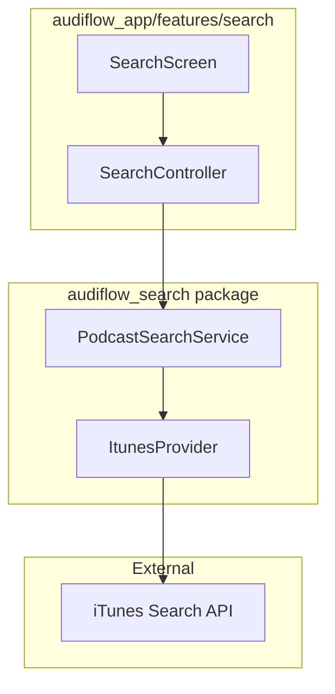
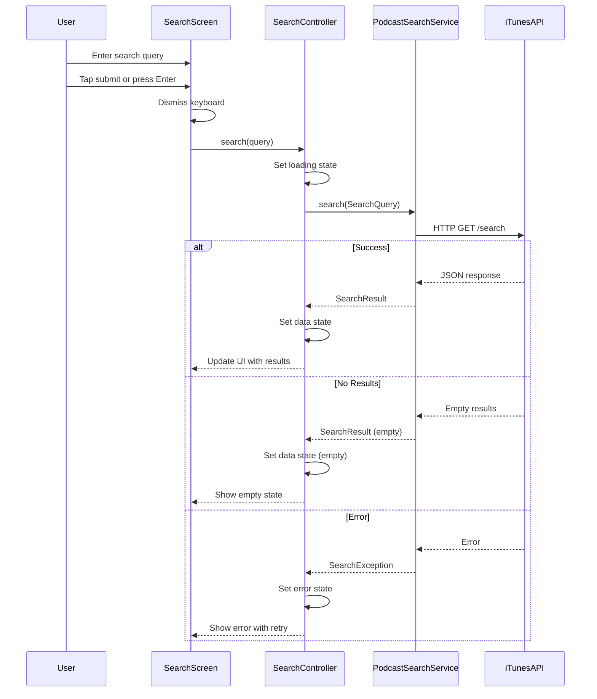

# Design Document: Search Page

## Overview

**Purpose**: This feature delivers a podcast discovery interface to users, enabling them to search for podcasts by keyword and browse results in a familiar podcast app style.

**Users**: All app users will utilize this for discovering new podcasts to subscribe to.

**Impact**: Introduces the first search screen in the application, integrating with the existing `audiflow_search` package for iTunes API access.

### Goals

- Provide an intuitive search input with keyboard submission support
- Display search results with artwork, title, author, genre, and summary
- Handle all UI states gracefully: initial, loading, results, empty, and error
- Enable navigation to podcast detail pages from search results

### Non-Goals

- Podcast subscription functionality (handled by separate feature)
- Search history or recent searches persistence
- Advanced filtering or sorting of results
- Offline search capabilities

## Architecture

### Architecture Pattern & Boundary Map



**Architecture Integration**:
- Selected pattern: Feature-based organization with Riverpod controllers
- Domain boundaries: UI logic in `audiflow_app`, search logic in `audiflow_search`
- Existing patterns preserved: Riverpod for state management, `@riverpod` code generation
- New components: SearchScreen, SearchController (Riverpod AsyncNotifier)
- Steering compliance: Repository pattern, separation of concerns

### Technology Stack

| Layer | Choice / Version | Role in Feature | Notes |
|-------|------------------|-----------------|-------|
| UI Framework | Flutter 3.38+ | Search screen and result list rendering | Material 3 design |
| State Management | Riverpod 3+ with code generation | SearchController state handling | `@riverpod` annotation |
| Search API | `audiflow_search` (internal) | iTunes podcast search | Existing package |
| Navigation | `go_router` | Podcast detail navigation | Existing routing setup |

## System Flows

### Search Flow



**Key Decisions**:
- Keyboard dismissal occurs before search initiation to improve UX
- Loading state prevents duplicate submissions via button disable
- Error state preserves last query for retry functionality

## Requirements Traceability

| Requirement | Summary | Components | Interfaces | Flows |
|-------------|---------|------------|------------|-------|
| 1.1 | Search text input field | SearchScreen | - | - |
| 1.2 | Submit button with search icon | SearchScreen | - | - |
| 1.3 | Submit button initiates search | SearchScreen, SearchController | SearchController.search() | Search Flow |
| 1.4 | Enter key initiates search | SearchScreen, SearchController | SearchController.search() | Search Flow |
| 1.5 | Dismiss keyboard on search | SearchScreen | - | Search Flow |
| 2.1 | Display result item info | SearchScreen, PodcastSearchResultTile | - | - |
| 2.2 | Results displayed below input | SearchScreen | - | - |
| 2.3 | Tap result navigates to detail | SearchScreen | GoRouter navigation | - |
| 3.1 | Loading indicator during search | SearchScreen | AsyncValue.loading | Search Flow |
| 3.2 | Prevent duplicate submissions | SearchController | - | Search Flow |
| 4.1 | Initial empty state | SearchScreen | AsyncValue.data (null) | - |
| 4.2 | No results found state | SearchScreen | AsyncValue.data (empty) | Search Flow |
| 5.1 | Error message display | SearchScreen | AsyncValue.error | Search Flow |
| 5.2 | Retry button on error | SearchScreen | - | Search Flow |
| 5.3 | Retry re-initiates search | SearchController | SearchController.retry() | Search Flow |

## Components and Interfaces

| Component | Domain/Layer | Intent | Req Coverage | Key Dependencies | Contracts |
|-----------|--------------|--------|--------------|------------------|-----------|
| SearchScreen | Presentation | Main search page UI | 1.1-1.5, 2.1-2.3, 3.1, 4.1-4.2, 5.1-5.2 | SearchController (P0) | State |
| SearchController | Presentation | Search state and logic | 1.3-1.4, 3.2, 5.3 | PodcastSearchService (P0) | Service |
| PodcastSearchResultTile | Presentation | Single result item display | 2.1 | Podcast model (P0) | - |

### Presentation Layer

#### SearchScreen

| Field | Detail |
|-------|--------|
| Intent | Main search page containing input, results list, and state displays |
| Requirements | 1.1, 1.2, 1.3, 1.4, 1.5, 2.1, 2.2, 2.3, 3.1, 4.1, 4.2, 5.1, 5.2 |

**Responsibilities & Constraints**
- Render search input field with submit button
- Display search results in scrollable list
- Show appropriate state indicators (loading, empty, error)
- Handle keyboard events and dismissal
- Navigate to podcast detail on result tap

**Dependencies**
- Inbound: None
- Outbound: SearchController - state management (P0)
- External: GoRouter - navigation (P1)

**Contracts**: State [x]

##### State Management

```dart
/// Search screen state representation
sealed class SearchState {
  const SearchState();
}

/// Initial state before any search
class SearchInitial extends SearchState {
  const SearchInitial();
}

/// Loading state during search request
class SearchLoading extends SearchState {
  const SearchLoading();
}

/// Success state with results (may be empty)
class SearchSuccess extends SearchState {
  const SearchSuccess({required this.result});
  final SearchResult result;

  bool get isEmpty => result.podcasts.isEmpty;
}

/// Error state with exception details
class SearchError extends SearchState {
  const SearchError({required this.exception, required this.lastQuery});
  final SearchException exception;
  final String lastQuery;
}
```

**Implementation Notes**
- Integration: Use `ConsumerWidget` with `ref.watch(searchControllerProvider)`
- Validation: Input field requires non-empty text for submission
- Risks: Large result sets may impact scroll performance; consider pagination in future

#### SearchController

| Field | Detail |
|-------|--------|
| Intent | Manages search state and coordinates with PodcastSearchService |
| Requirements | 1.3, 1.4, 3.2, 5.3 |

**Responsibilities & Constraints**
- Execute search requests via PodcastSearchService
- Track current search state (initial/loading/success/error)
- Preserve last query for retry functionality
- Prevent duplicate concurrent searches

**Dependencies**
- Inbound: SearchScreen - UI interaction (P0)
- Outbound: PodcastSearchService - search execution (P0)

**Contracts**: Service [x]

##### Service Interface

```dart
@riverpod
class SearchController extends _$SearchController {
  String? _lastQuery;

  @override
  SearchState build() => const SearchInitial();

  /// Executes a podcast search with the given query.
  ///
  /// Preconditions:
  /// - query must not be empty or whitespace-only
  /// - no search currently in progress (state != SearchLoading)
  ///
  /// Postconditions:
  /// - state transitions to SearchLoading, then SearchSuccess or SearchError
  /// - _lastQuery is updated to the provided query
  Future<void> search(String query) async {
    if (state is SearchLoading) return; // Prevent duplicates (3.2)

    final trimmed = query.trim();
    if (trimmed.isEmpty) return;

    _lastQuery = trimmed;
    state = const SearchLoading();

    try {
      final service = ref.read(podcastSearchServiceProvider);
      final result = await service.search(
        SearchQuery.validated(term: trimmed),
      );
      state = SearchSuccess(result: result);
    } on SearchException catch (e) {
      state = SearchError(exception: e, lastQuery: trimmed);
    }
  }

  /// Retries the last failed search.
  ///
  /// Preconditions:
  /// - _lastQuery must not be null
  ///
  /// Postconditions:
  /// - Equivalent to calling search(_lastQuery)
  Future<void> retry() async {
    if (_lastQuery != null) {
      await search(_lastQuery!);
    }
  }
}
```

**Implementation Notes**
- Integration: Provider created via `@riverpod` annotation, auto-disposed
- Validation: Empty query check before API call to avoid unnecessary requests
- Risks: Network failures handled via SearchException; consider timeout configuration

#### PodcastSearchResultTile

| Field | Detail |
|-------|--------|
| Intent | Displays a single podcast search result with artwork and metadata |
| Requirements | 2.1 |

**Responsibilities & Constraints**
- Render podcast artwork with fallback placeholder
- Display title, author, genre (first), and truncated summary
- Handle tap gesture for navigation callback

**Dependencies**
- Inbound: SearchScreen - parent widget (P0)
- Outbound: None

**Contracts**: State [x]

##### State Management

```dart
/// Props for PodcastSearchResultTile
class PodcastSearchResultTileProps {
  const PodcastSearchResultTileProps({
    required this.podcast,
    required this.onTap,
  });

  /// Podcast data to display
  final Podcast podcast;

  /// Callback when tile is tapped
  final VoidCallback onTap;
}
```

**Implementation Notes**
- Integration: Stateless widget receiving Podcast model from parent
- Validation: Null-safe access for optional fields (description, artworkUrl)
- Risks: Missing artwork URL requires placeholder image handling

## Data Models

### Domain Model

The search feature uses existing models from `audiflow_search` package:

- **Podcast** (Value Object): Immutable podcast metadata with id, name, artistName, genres, description, artworkUrl
- **SearchQuery** (Value Object): Validated search parameters with term, country, limit
- **SearchResult** (Aggregate): Collection of Podcast results with totalCount, provider, timestamp
- **SearchException** (Domain Event): Error information with code, message, providerId

See `packages/audiflow_search/lib/src/models/` for model definitions.

**Key Invariants**:
- Podcast.id is required and uniquely identifies a podcast
- SearchQuery.term must not be empty (validated at construction)
- SearchResult.podcasts may be empty (valid empty result)

### Data Contracts & Integration

**API Data Transfer**
- Request: SearchQuery transformed to iTunes API query parameters
- Response: JSON parsed to List<Podcast> via Podcast.fromJson()
- Validation: SearchQuery.validated() enforces term non-empty, limit 1-200

**Cross-Feature Data**
- Podcast.id used for navigation to podcast detail screen
- Podcast model may be passed to subscription feature (future integration)

## Error Handling

### Error Strategy

Errors are captured as `SearchException` with gRPC-style status codes. The UI maps exceptions to user-friendly messages.

### Error Categories and Responses

| Error Type | Status Code | User Message | Recovery Action |
|------------|-------------|--------------|-----------------|
| Network unavailable | UNAVAILABLE | "Unable to connect. Check your internet connection." | Retry button |
| Timeout | DEADLINE_EXCEEDED | "Search timed out. Please try again." | Retry button |
| Rate limited | RESOURCE_EXHAUSTED | "Too many requests. Please wait a moment." | Retry button (with delay) |
| Invalid input | INVALID_ARGUMENT | "Please enter a valid search term." | Edit input |
| Server error | INTERNAL | "Something went wrong. Please try again." | Retry button |

### Monitoring

- Log search queries and response times via `Logger` package
- Track error rates by StatusCode for operational visibility
- Consider Sentry integration for production error tracking

## Testing Strategy

### Unit Tests (SearchController)

- `search()` transitions state from Initial to Loading to Success
- `search()` transitions state from Initial to Loading to Error on exception
- `search()` with empty query does not trigger API call
- `search()` during loading state is ignored (duplicate prevention)
- `retry()` re-executes last query

### Widget Tests (SearchScreen)

- Renders search input field and submit button
- Submit button tap triggers search
- Enter key press triggers search
- Loading indicator displayed during search
- Results list rendered with correct item count
- Empty state displayed when results empty
- Error state displayed with retry button
- Retry button tap triggers retry

### Integration Tests

- End-to-end search flow with mocked API response
- Navigation to podcast detail on result tap
- Keyboard dismissal on search initiation

## Optional Sections

### Performance & Scalability

**Target Metrics**:
- Search response: < 2s (network-dependent)
- UI render: < 16ms per frame during scroll

**Optimization**:
- Use `ListView.builder` for lazy result rendering
- Cache artwork images via `extended_image` or `cached_network_image`
- Consider debouncing if search-as-you-type is added later
